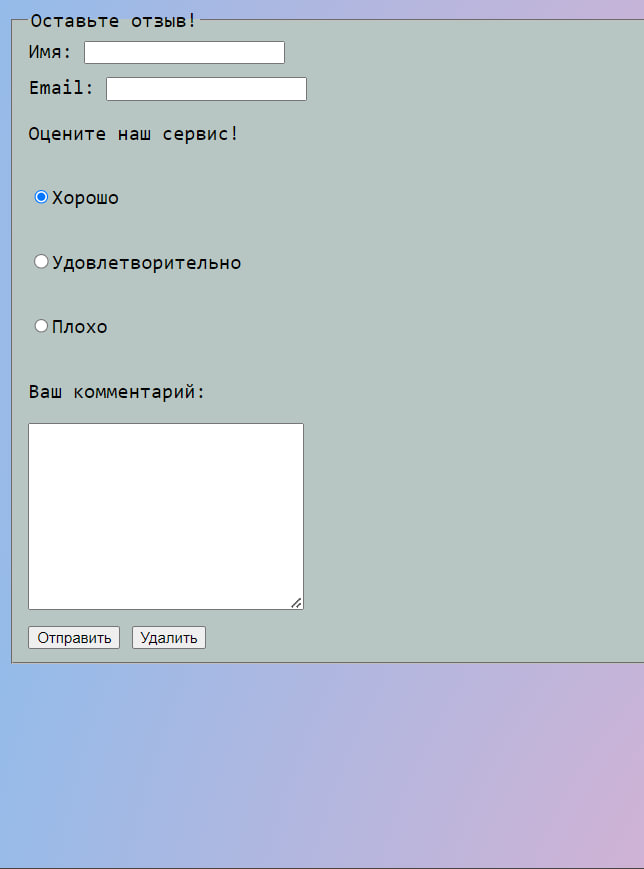

# Лабораторная работа № 4

## 1.  Работа с глобальной переменной `$_POST`
__1.1.__ Интерпретируйте и проанализируйте следующий код.   
__1.2.__ Добавьте в отмеченную область код, который будет отображать сообщение только после отправки формы.  

```php
 <?php 
 if ($_SERVER["REQUEST_METHOD"] == "POST") {
    echo '<div id="result">
    <p>Ваше имя: <b>'. $_POST["name"].'</b></p>
    <p>Ваш e-mail: <b>'. $_POST["email"].'</b></p>
    <p>Оценка товара: <b>'. $_POST["review"].'</b></p>
    <p>Ваше сообщение: <b>' . $_POST["comment"].'</b></p>
    </div>';
    echo "<p>Форма успешно отправлена!</p>";
}
?>
```
> Этот код берет данные, введенные пользователем в форму и выводит их на страницу в виде HTML-разметки, если форма была отправлена методом `POST`.

__1.3.__ Добавьте под формой функцию для проверки данных, гарантирующую заполнение всех полей и корректность введенного e-mail.  
```php
function validateFormData($formData) {
    $errors = array();

    if (empty($formData['name'])) {
        $errors[] = "Пожалуйста, введите ваше имя.";
    }
    // Проверка валидности e-mail
    if (!filter_var($formData['email'], FILTER_VALIDATE_EMAIL)) {
        $errors[] = "Пожалуйста, введите корректный e-mail адрес.";
    }

    if (empty($formData['comment'])) {
        $errors[] = "Пожалуйста, напишите ваш комментарий.";
    }
    return $errors;
}
```
>Добавлена данная функция, которая проверяет введены ли данные и корректны ли они. Также для их отображения добавлены некие изменения в условии для вывода 

__1.4.__ Объясните, что такое глобальная переменная `$_POST` и `$_SERVER[“PHP_SELF”]`
>`$_POST` - ассоциативный массив, который содержит данные, отправленные на сервер методом `POST` через HTTP-запрос.
`$_SERVER[“PHP_SELF”]` - возвращает имя файла , в котором выполняется текущий скрипт

## Screenshots  
__Изначальная форма__
  
__Отправка пустой формы__
  
__Вывод сообщений__
  

## 2. Получение данных с различных контроллеров
__2.1.__ Создайте форму, состоящую минимум из 3 контроллеров (input, select)  
__2.1.1.__ Минимум 1 input с типом number  
__2.1.2.__ Минимум 1 select  
__2.2.__ Тема формы определяется на ваш выбор  
__2.3.__ Обработайте данные и выведите их на экран  

>Созданная форма позволяет пользователю ввести своё имя, возраст и выбрать свой пол. После отправки формы, введенные данные обрабатываются на сервере  и выводятся на экран для просмотра пользователями.

## Screenshots  
__Изначальная форма__

__Вывод введённых данных на экран__


## 3. Создание, обработка и валидация форм
__3.1.__ Создайте форму, показанную на рисунке (Рисунок 1)  
__3.2.__ Создайте собственную функцию валидации, которая будет проверять все поля формы при получении запроса  
__3.2.1.__ Для поля “name”: установите минимальную длину в 3 символа, максимальную - 20 символов, и запретите использование цифр. 
```php
        if (empty($_POST["name"])) {
            $nameErr = "Name is required";
        } else {
            $name = test_input($_POST["name"]);
            // проверка на длину имени и отсутствие цифр
            if (strlen($name) < 3 || strlen($name) > 20 || preg_match('/[0-9]/', $name)) {
                $nameErr = "Name must be between 3 and 20 characters long and contain no digits";
            }
        }
```
__3.2.2.__ Для поля “mail”: удостоверьтесь, что адрес электронной почты соответствует стандартам.  
```php
        if (empty($_POST["email"])) {
            $emailErr = "Email is required";
        } else {
            $email = test_input($_POST["email"]);
            // проверка соответствия формату email
            if (!filter_var($email, FILTER_VALIDATE_EMAIL)) {
                $emailErr = "Invalid email format";
            }
        }
```
__3.2.3.__ Для поля “comment”: удостоверьтесь, что оно не пустое и укажите какие-либо другие необходимые критерии валидации (на ваш выбор). 
```php
        if (empty($_POST["comment"])) {
            $commentErr = "Comment is required";
        } else {
            $comment = test_input($_POST["comment"]);
        }
``` 
__3.2.4.__ Убедитесь, что пользователь отметил галочку “Do you agree with data processing?” перед отправкой формы"  
```php
        if (empty($_POST["agree"])) {
            $agreeErr = "You must agree to data processing";
        } else {
            $agree = test_input($_POST["agree"]);
        }
```
__3.4.__ Если пользователь верно ввел данные, выведите комментарий ниже формы (не требуется сохранение комментариев где-либо)  
```php
 if ($_SERVER["REQUEST_METHOD"] == "POST" && $nameErr == "" && $emailErr == "" && $commentErr == "" && $agreeErr == "") {
        echo "<h2>Thank you for your submission!</h2>";
    }
```
## Screenshots  
__Ввод данных__

__Отправка пустой формы__

__Вывод сообщения об успешной отправке__
  
__3.5.__ Чем отличается глобальная переменная $_REQUEST и $_POST?  
>Глобальная переменная `$_REQUEST` в PHP содержит данные, переданные скрипту через HTTP-запрос (GET, POST, COOKIE), в то время как переменная `$_POST` содержит данные, отправленные методом POST.
## 4. Создание формы
__4.1.__ Создайте тест из 3-х вопросов используя input, type radio, и input, type checkbox и запросите имя пользователя. Проверьте заполнение формы и варианты, выбранные пользователем. Выведите результаты на экран.